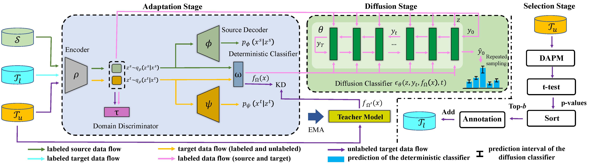

# Diffusion-Based Probabilistic Uncertainty Estimation for Active Domain Adaptation

A Pytorch implementation of Diffusion-Based Probabilistic Uncertainty Estimation for Active Domain Adaptation, Zhekai Du, Jingjing Li, **NeurIPS 2023**.

<div align="center">
  
</div>

    
## Environment

1. numpy==1.23.5

2. Pillow==10.1.0

3. PyYAML==6.0.1

4. scikit_learn==1.2.0

5. scipy==1.11.4

6. torch==1.13.0+cu116

7. torchvision==0.14.0+cu116

## How to Run the Code
To run an instance on task A->D for ADA:

Set the experimental configurations in `configs/office-31.yml`, ensuring that `source_pretrain_epochs = 0`, and run

```bash
python main.py --config ./configs/office-31.yml --source_domain amazon --target_domain dslr --setting ADA
```
To run an instance for task A->D for SFADA:

Set the experimental configurations in `configs/office-31.yml`, ensuring that `source_pretrain_epochs > 0`, and run 

```bash
python main.py --config ./configs/office-31.yml --source_domain amazon --target_domain dslr --setting SFADA
```
## Citation
If you find the code useful in your research, please consider citing:

    @InProceedings{du2023diffusion,
      author = {Du, Zhekai and Li, Jingjing},
      title = {Diffusion-Based Probabilistic Uncertainty Estimation for Active Domain Adaptation},
      booktitle = {Advances in Neural Information Processing Systems},
      year = {2023}
    }

## Acknowledgments
This project builds upon the invaluable contributions of following open-source projects:

1. EADA (https://github.com/BIT-DA/EADA)
2. CARD (https://github.com/XzwHan/CARD)

We express our sincere gratitude to the talented authors who have generously shared their source code with the public, enabling us to leverage their work in our own endeavor.